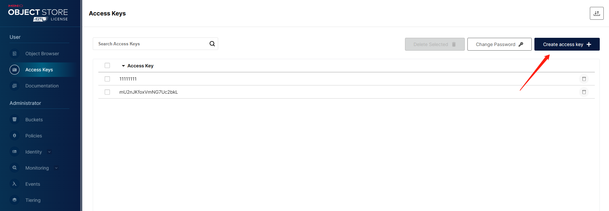

# 记录一下Minio学习过程
这是个人学习笔记，垃圾水文，毫无参考意义，刷到了直接划走即可。

## Minio安装
直接下载可执行文件即可，或者拉源码下来编译。

## 新建Bucket
首先登录控制台： http://127.0.0.1:9000 ， 然后用默认账户登录：
```
RootUser: minioadmin
RootPass: minioadmin
```


## 创建访问KEY


## 测试
```go
package main

import (
	"context"
	"fmt"
	"log"

	"github.com/minio/minio-go/v7"
	"github.com/minio/minio-go/v7/pkg/credentials"
)

func main() {
	endpoint := "127.0.0.1:9000"
	accessKeyID := "11111111"
	secretAccessKey := "11111111"

	minioClient, err := minio.New(endpoint, &minio.Options{
		Creds:  credentials.NewStaticV4(accessKeyID, secretAccessKey, ""),
		Secure: false,
	})
	if err != nil {
		log.Fatalln(err)
	}
	ctx := context.Background()
	objectName := "1-1.png"
	contentType := "image/png"

	// Upload the zip file with FPutObject
	info, err := minioClient.FPutObject(
		ctx, "images", objectName, `C:\Users\wangwenhai\workspace\minio-demo1\1.png`,
		minio.PutObjectOptions{ContentType: contentType},
	)
	if err != nil {
		log.Fatalln(err)
	}

	objectCh := minioClient.ListObjects(ctx, "images", minio.ListObjectsOptions{
		Recursive: true,
	})
	for object := range objectCh {
		if object.Err != nil {
			fmt.Println(object.Err)
			return
		}
		fmt.Println(object.Key)
	}
	log.Printf("Successfully uploaded %s of size %d\n", objectName, info.Size)
}

```

## 效果
